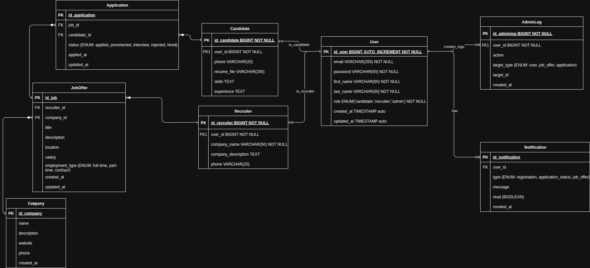

# RecruitingApp

## 🚀 Recruiting Platform App

A full-stack recruitment platform simulating real-world job portals like LinkedIn and Indeed, built with Spring Boot
backend and React frontend.

## 🎯 Project Overview

This platform enables three main user types to manage recruitment processes:

- **Recruiters** - Post jobs and manage applications
- **Candidates** - Discover opportunities and track applications
- **Administrators** - Manage users and platform operations

## ✨ Features

### Core Functionality

- ✅ **Job Management** - Create, edit, and publish job offers
- ✅ **Application System** - Candidates can apply and track status
- ✅ **User Management** - Role-based access control
- ✅ **Notification System** - Real-time updates for applications

### User Stories Implemented

- **As a recruiter**: I can post jobs and manage hiring processes
- **As a candidate**: I can apply for jobs and follow my application status
- **As an administrator**: I can manage users and platform content

## 🛠️ Technology Stack

### Backend (Current Implementation)

- **Java 21** - Programming language
- **Spring Boot 3.5.5** - Framework
- **Spring Data JPA** - Database persistence
- **Spring Security** - Authentication & authorization
- **MySQL** - Database
- **Maven** - Dependency management
- **Lombok** - Code reduction

### Frontend (Planned)

- React.js
- JavaScript/TypeScript
- CSS3/Tailwind

## 📊 Database Design



The database schema includes:

- **Users** - Base user information with role-based access
- **Candidates** - Extended candidate profiles
- **Recruiters** - Recruiter and company information
- **JobOffers** - Job postings and details
- **Applications** - Application tracking system
- **Notifications** - User notification system

## 🚀 Getting Started

### Prerequisites

- Java 21+
- MySQL 9.4+
- Maven 3.6+
- Node.js 16+ (for frontend)

### Backend Installation

```bash
cd 

backend/recruiting-app
mvn clean install
mvn spring-boot:run
```

### Environment Configuration

Create `application.properties`:

```properties
spr
ing.datasource.url=jdbc:mysql://localhost:3306/recruiting_db
spring.datasource.username=your_username
spring.datasource.password=your_password
spring.jpa.hibernate.ddl-auto=update
```

## 📁 Project Structure

```
rec

ruiting-platform/
├── backend/                 # Spring Boot application
│   ├── recruiting-app/
│   │   ├── src/
│   │   │   ├── main/java/com/hackathon/recruiting_app_backend/
│   │   │   │   ├── model/      # Entity classes
│   │   │   │   ├── repository/ # Data access layer
│   │   │   │   ├── service/    # Business logic
│   │   │   │   ├── controller/ # REST API endpoints
│   │   │   │   └── config/     # Security and configuration
│   │   │   └── resources/      # Properties and static files
│   │   └── pom.xml            # Maven dependencies
├── frontend/                # React application (to be implemented)
├── database/               # SQL scripts and ER diagrams
└── documentation/         # Project documentation
```

## 🔐 Security Features

- Role-based authentication (Candidate, Recruiter, Admin)
- JWT token-based security
- Password encryption
- Protected API endpoints
- CORS configuration

## API Endpoints (Planned)

| Method | Endpoint            | Description         | Access    |
|--------|---------------------|---------------------|-----------|
| POST   | `/api/auth/login`   | User authentication | Public    |
| GET    | `/api/jobs`         | List job offers     | Public    |
| POST   | `/api/jobs`         | Create job offer    | Recruiter |
| POST   | `/api/applications` | Submit application  | Candidate |
| GET    | `/api/users`        | List users          | Admin     |

## 🎨 Frontend Preview (Upcoming)

The frontend will feature:

- Responsive design for desktop and mobile
- Interactive dashboards for each user type
- Real-time notification system
- Advanced job search and filtering
- Application status tracking

## 📋 Development Progress

### ✅ Completed

- [x] Project setup with Spring Initializr
- [x] Basic Spring Boot configuration
- [x] Database schema design (ERD)
- [x] Maven dependencies configuration

### 🚧 In Progress

- [ ] Entity classes implementation
- [ ] Repository layer development
- [ ] Spring Security configuration
- [ ] REST API endpoints

### 📅 Planned

- [ ] Frontend React application
- [ ] JWT authentication implementation
- [ ] Notification system
- [ ] Advanced search functionality

## 🤝 Contributing

1. Fork the project
2. Create your feature branch (`git checkout -b feature/AmazingFeature`)
3. Commit your changes (`git commit -m 'Add some AmazingFeature'`)
4. Push to the branch (`git push origin feature/AmazingFeature`)
5. Open a Pull Request

## 📄 License

This project is licensed under the GNU General Public License v3.0 (GPL-3.0).  
See the [LICENSE](LICENSE) file for details.

## 📌 Project Management

This project is managed using **[Taiga](https://www.taiga.io/)** for backlog, sprints, and epics tracking.

- 📋 [Backlog](https://tree.taiga.io/project/martinbergagno-recruitingapp/backlog)
- 🗂️ [Epics](https://tree.taiga.io/project/martinbergagno-recruitingapp/epics)
- 🏃 Sprint Boards available per iteration

## 🙏 Acknowledgments

- Spring Boot team for the excellent framework
- Taiga for project management tools
- The recruitment platform concept inspired by LinkedIn and Indeed

## 💡 To customize your README:

2. **Update progress** as you go
3. **Include screenshots** when you have the UI
4. **Add badges** for build status, coverage, etc.
5. **Mention your Taiga board** if it is public
